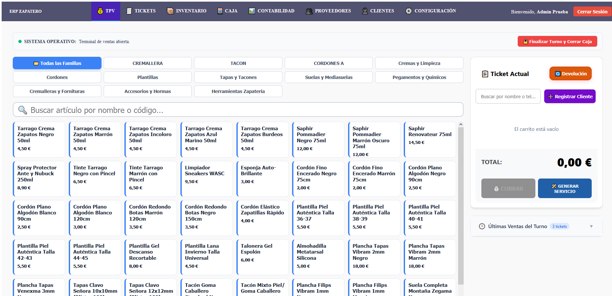
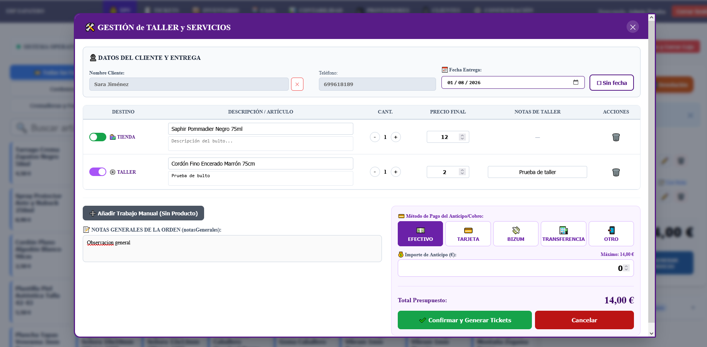
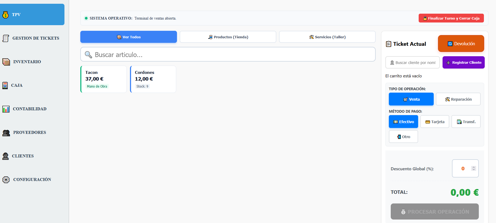
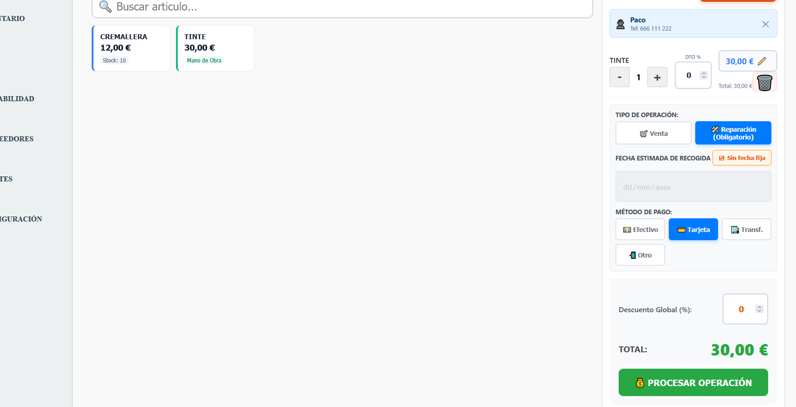
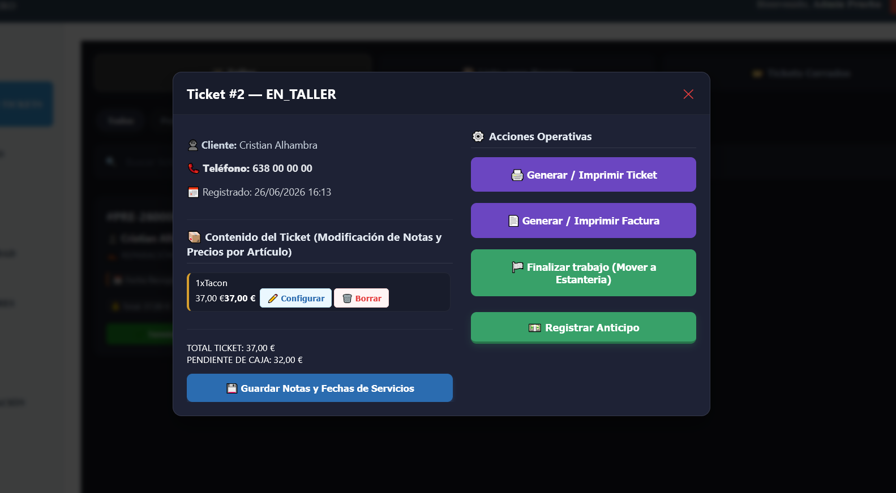
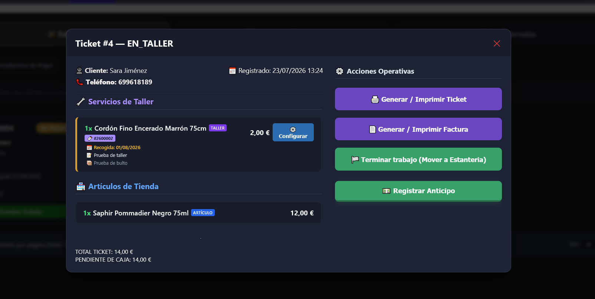
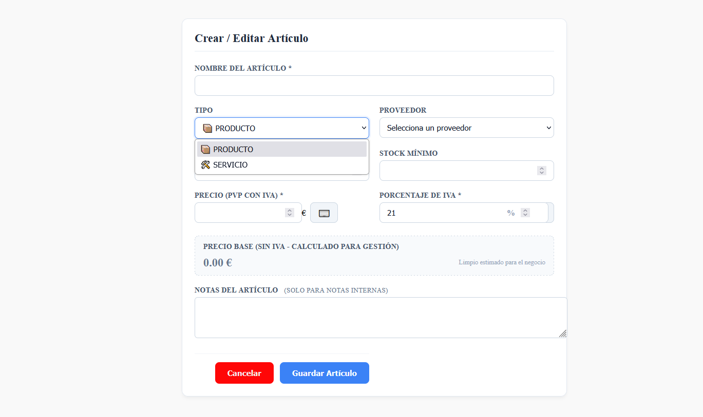
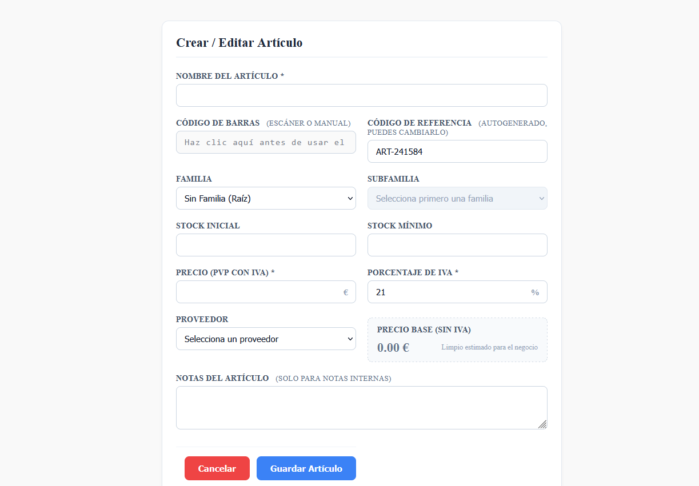

# 👞 VeriFactu ERP/TPV Multi-Tenant (v2.0)

Sistema de Gestión de Punto de Venta (TPV) y ERP multi-inquilino orientado a comercios locales y talleres de reparación/calzado, diseñado con arquitectura moderna en Angular y preparado para el cumplimiento de la normativa tributaria española (**VeriFactu**).

---

## 🌐 Demo Pública

🔗 Demo: [https://erp.javier-moreno.dev/login]

---

## 📸 Vista General de la Aplicación (v2.0)

| TPV & Mostrador (V2) | Generador de Servicios & Taller |
| :---: | :---: |
|  |  |

---

## 🔄 Evolución de la Interfaz (V1 vs. V2)

### 1. Punto de Venta (TPV) & Layout General
| Versión 1.0 | Versión 2.0 |
| :---: | :---: |
|  |  |
| *Menú lateral rígido y selección fija producto/servicio.* | *Cabecera por pestañas, familias dinámicas y espacio optimizado.* |

### 2. Flujo de Taller & Servicios
| Versión 1.0 (Formulario Aislado) | Versión 2.0 (Generador All-In-One) |
| :---: | :---: |
|  |  |
| *Proceso en varios pasos independientes.* | *Venta, taller, cliente, fecha y cobro en una sola vista.* |

### 3. Contenido del ticket
| Versión 1.0 (Ticket antiguo) | Versión 2.0 (Nuevo ticket) |
| :---: | :---: |
|  |  |
| *Proceso en varios pasos independientes.* | *Venta, taller, cliente, fecha y cobro en una sola vista.* |

### 4. Inventario & Trazabilidad
| Versión 1.0 (Lista Plana) | Versión 2.0 (Familias y Códigos) |
| :---: | :---: |
|  |  |
| *División básica entre producto y servicio.* | *Estructura jerárquica con referencia y lector de código de barras.* |

---

## 🚀 Detalles de la Evolución (V1 vs. V2)

### 📌 Versión 1.0 — MVP & Estructura Base
* **Gestión de Ventas & Taller:** Punto de venta básico diferenciado entre productos y servicios. Registro de órdenes con estados de trazabilidad y emisión de tickets térmicos (80mm).
* **Navegación & Layout:** Menú lateral desplegable a la izquierda y barra inferior desplegable a ancho completo.
* **Carrito & Caja:** Selección manual de cobro (efectivo/tarjeta, sin soporte para Bizum) e indicadores de operaciones integrados en la vista general.
* **Inventario & Contactos:** Organización simple por tipo de ítem y tablas básicas de proveedores/clientes.
* **Preparación VeriFactu:** Arquitectura backend inicial para el encadenamiento y firma de registros de facturación.

---

### 🌟 Versión 2.0 — Rediseño de UX, Flujo Unificado & Escalabilidad (Versión Actual)

La V2 supone una reestructuración completa basada en las necesidades reales de un entorno de mostrador/taller, optimizando tiempos de cobro y adaptando la interfaz a pantallas táctiles, tablets y teléfonos móviles.

#### 🖨️ TPV, Carrito & Generador de Servicios "All-in-One"
* **Flujo Unificado de Cobro:** Integración del nuevo **Generador de Servicios**, que permite asociar en una sola pantalla artículos de venta directa, trabajos de taller, asignación de cliente, fecha de recogida y método de pago.
* **Devoluciones & Abonos Rectificativas (`DEV-`):** Módulo de abonos parciales con selección inteligente de líneas (diferenciando artículos de tienda vs. servicios de taller) para mantener la trazabilidad de los tickets originales.
* **Generación Individual de Tickets:** Generación de tickets con identificador único por servicio para un control exhaustivo en la recogida.
* **Modificación Rápida en Carrito:** Edición directa en el carrito de precios y descuentos aplicados a artículos físicos.

#### 📂 Categorización Avanzada & Buscadores
* **Familias y Subfamilias:** Reorganización del inventario y del TPV eliminando la división rígida de producto/servicio en favor de una estructura jerárquica por familias.
* **Trazabilidad de Inventario:** Incorporación de **código de referencia** y **código de barras** para agilizar lecturas.
* **Búsqueda Optimizada:** Buscadores con autocompletado y filtrado desde el primer carácter introducido.

#### 🎨 Rediseño de Layout & Responsive
* **Nuevo Navigation Layout:** Transición del menú lateral V1 a una cabecera superior moderna con pestañas de acceso rápido.
* **Diseño Multidispositivo:** Interfaz 100% *responsive* adaptada para ordenadores de mostrador, tablets y teléfonos móviles.
* **Paginación Global:** Implementación de paginación eficiente en TPV, Tickets, Inventario, Clientes y Proveedores.

#### 📊 Caja & Datos
* **Nuevos Métodos de Pago:** Integración de cobros mediante **Bizum**.
* **Importación/Exportación de Datos:** Soporte completo para carga y descarga de información en formatos **CSV y Excel** desde el panel de Configuración.
* **Previsualización & Reimpresión:** Sistema dinámico de previsualización de tickets térmicos en PDF mediante iFrames sanitizados y soporte para reimpresión directa.

---

## 🛠️ Guía de Desarrollo & Comandos (Angular CLI)

Este proyecto fue generado con [Angular CLI](https://github.com/angular/angular-cli).

### Servidor de Desarrollo

Para iniciar el servidor local de desarrollo, ejecuta:

``bash
ng serve

Navega a http://localhost:4200/. La aplicación se recargará automáticamente si cambias algún archivo fuente.

Compilación (Build)

Para compilar el proyecto para producción:

ng build

Los archivos resultantes se guardarán en el directorio dist/.

Pruebas Unitarias
Para ejecutar las pruebas unitarias con el ejecutor Vitest:

ng test